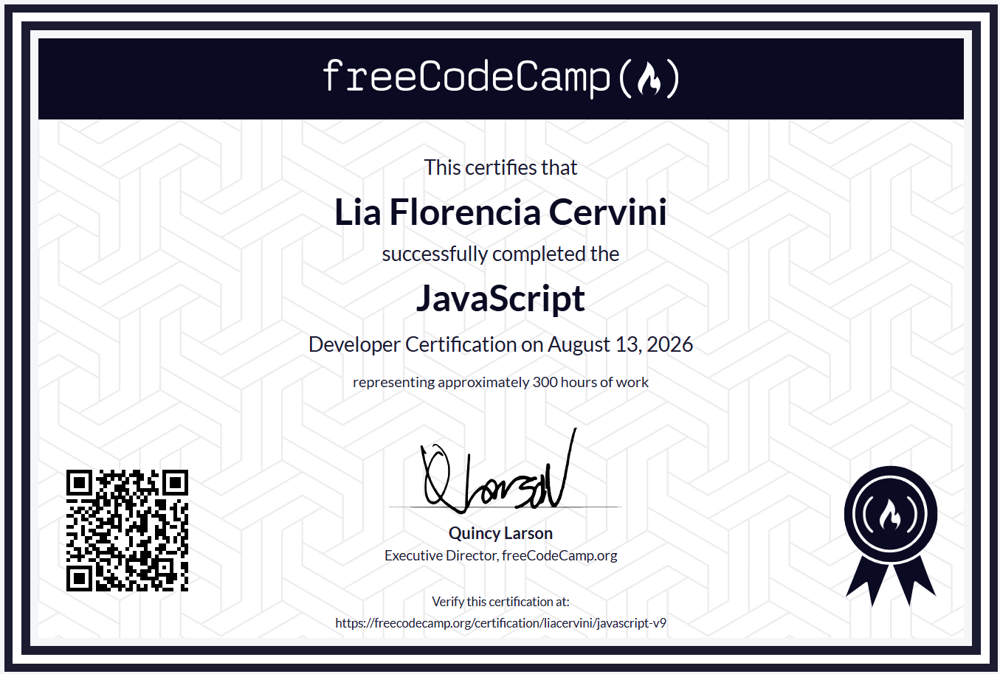

# 🏆 JavaScript Developer Certification

## 🇪🇸 Español

Completé la **JavaScript Developer Certification** de freeCodeCamp.

Esta certificación representa aproximadamente **300 horas de trabajo** y forma parte de mi recorrido de aprendizaje en JavaScript, algoritmos, estructuras de datos y resolución de problemas.

📅 Fecha de certificación: **13 de agosto de 2026**

🔗 Verificación oficial:  
https://freecodecamp.org/certification/liacervini/javascript-v9

---

## 🇺🇸 English

I completed the **JavaScript Developer Certification** from freeCodeCamp.

This certification represents approximately **300 hours of work** and is part of my learning journey in JavaScript, algorithms, data structures, and problem solving.

📅 Certification date: **August 13, 2026**

🔗 Official verification:  
https://freecodecamp.org/certification/liacervini/javascript-v9

